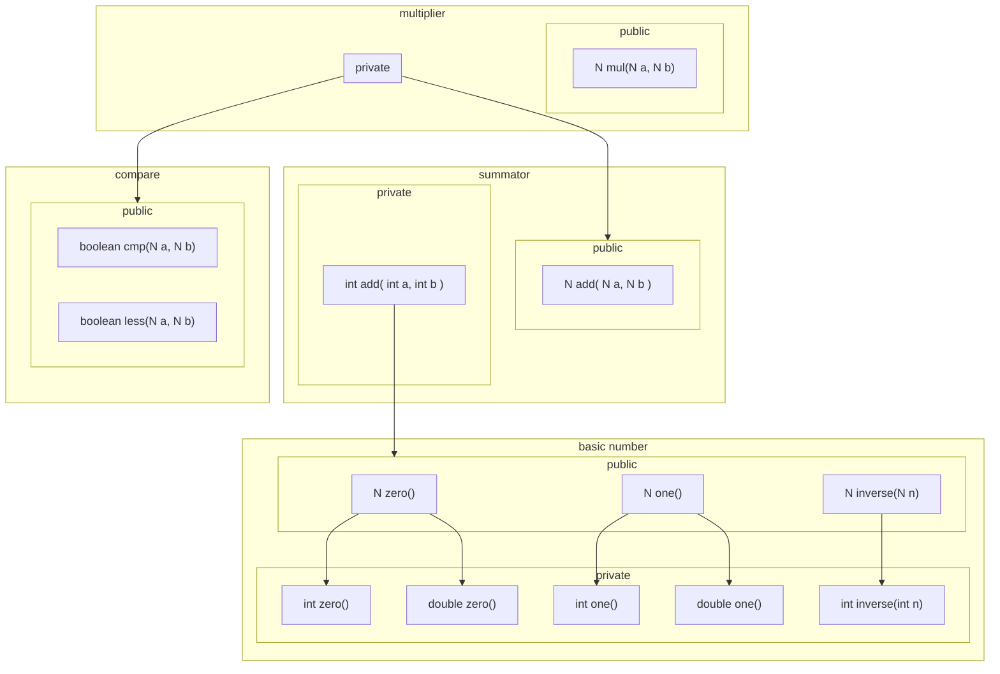

PatrCollect.createKV(String s)
==================================

Несколько замечаний

1. метод имеет смысл пометить `private`
2. дать полное имя метода - `createKeyValue`
3. дать имя аргументу `s`
4. изменить тип результата

Метод имеет смысл пометить `private`
--------------------------------------

Любой код разделяется на публичную и приватную часть
, смысл - публичные части используют другие классы, которые не знают о внутренней реализации.

Кол-во публичных частей следует минимизировать - что бы не приходилось много переписывать, а переписывать придется.

Например нужна либа по математическим операциям, притом абстрактная либа, где
- `N` - некий математический объект (int, bit, duration, weight)
- нужны следующие операции: сравнение, умножение, сложение
- нужно само абстрактное понятие числа (мат-объект), который удовлетворяет аксиомам:
    - a + 0 = a
    - 0 + a = a
    - 1 * a = a
    - a * 1 = a
    - a * 0 = 0
    - 0 * a = 0
- результат любого сравнения - булево (true/false)
    - операции `< <= == != >= >`
    - Минимизация: вообще нужно всего две операции в API `< ==`, остальные выводятся через перестановки аргументов и логические операции И/ИЛИ/НЕ 
- операция умножения - это комбинация операции сложения и сравнения в цикле

если все выше переворить, то структура public/private будет такая

где 
- N - абстракция
- int/double - конкретика

обрати внимание: 
- что из private идут связи на public
- нет цикличных связей, т.е. a -> b -> c -> a
    - наличие циклов связей между модулями/функция превращает код в монолит, которыей тяже разделить на модули <- _за одно потянешь, все рухнет_

дать полное имя метода - `createKeyValue`
-----------------------------------------
KV - сокращение, которое очевидно автору, для других это имплицитное знание, лучше иметь эксплицитное описание - переводимое назваие или [javadoc описание](https://www.oracle.com/technical-resources/articles/java/javadoc-tool.html)

дать имя аргументу `s`
-----------------------------

аналогично - дать полное имя метода

изменить тип результата
-------------------------

[отдельный разбор](review-1t.md)