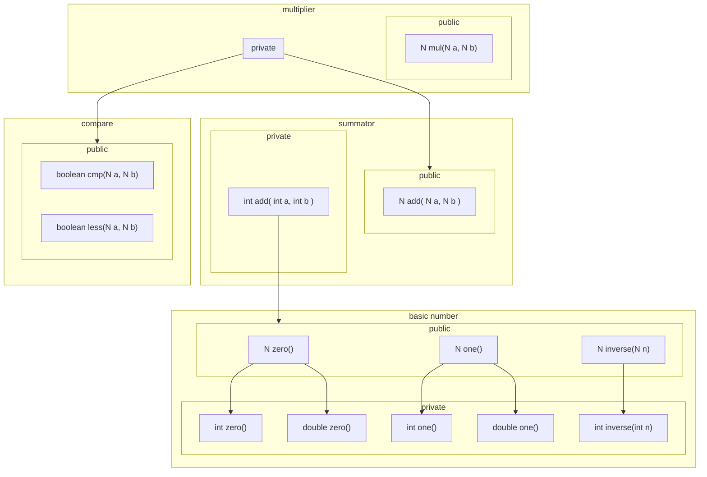

PatrCollect.createKV(String s)
==================================

Несколько замечаний

1. метод имеет смысл пометить `private`
2. дать полное имя метода - `createKeyValue`
3. дать имя аргументу `s`
4. изменить тип результата

Метод имеет смысл пометить `private`
--------------------------------------

Любой код разделяется на публичную и приватную часть
, смысл - публичные части используют другие классы, которые не знают о внутренней реализации.

Кол-во публичных частей следует минимизировать - что бы не приходилось много переписывать, а переписывать придется.

